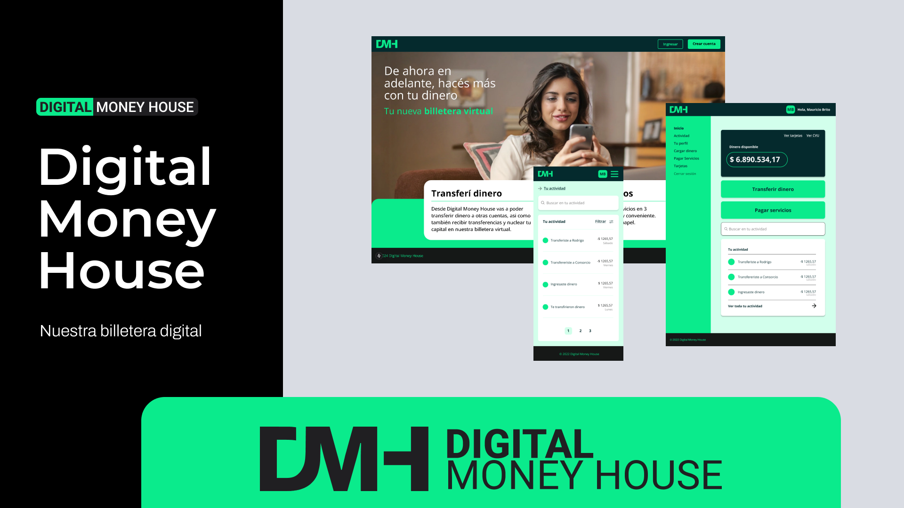

# 💰 Digital Money House - Billetera Virtual

**Digital Money House es una billetera virtual desarrollada como proyecto final para la certificación Front-End Developer en Digital House. Construida con Next.js y TypeScript, esta aplicación permite a los usuarios gestionar sus finanzas de manera integral, incluyendo la administración de tarjetas, la realización de transferencias, pagos de servicios y la visualización detallada de la actividad financiera.**

Este proyecto representa la culminación de los conocimientos adquiridos durante la certificación, permitiendo la integración de conceptos, tecnologías y funcionalidades necesarias para el desarrollo efectivo de una aplicación práctica y funcional. A través de este desarrollo, se desafiaron y fortalecieron habilidades tanto técnicas como de desarrollo profesional.

## 🛠️ Tecnologías Utilizadas

Este proyecto Front-end fue construido utilizando las siguientes tecnologías principales:

* ⚡ **Next.js:** Framework de React que ofrece renderizado del lado del servidor (SSR) para un mejor rendimiento y SEO, facilitando un desarrollo rápido y eficiente.
* 🏷️ **TypeScript:** Superset de JavaScript que añade tipado estático para mayor seguridad, mantenibilidad y una mejor experiencia de desarrollo.
* 🎨 **Tailwind CSS:** Framework de CSS utility-first para estilos rápidos, responsive y altamente personalizables.
* 📝 **React Hook Form + Yup:** Librería para el manejo de formularios de manera declarativa y validaciones robustas basadas en esquemas.
* 🔗 **Zustand:** Librería simple y escalable para la gestión del estado global de la aplicación, facilitando la comunicación entre componentes.
* 🔄 **React Query:** Librería para la gestión eficiente de consultas asíncronas, caché y actualizaciones en segundo plano de datos provenientes de la API.
* 🔔 **Sonner:** Librería para mostrar notificaciones de usuario intuitivas y atractivas.
* **API REST:** Arquitectura utilizada para la comunicación con el backend y la realización de operaciones financieras.
* **Jest + React Testing Library:** Framework y librería para la implementación de pruebas unitarias y de integración de los componentes de React, asegurando la calidad del código.

## ✨ Funcionalidades Principales

La aplicación Digital Money House ofrece las siguientes funcionalidades clave:

* 🔐 **Registro e inicio de sesión:** Con autenticación segura basada en tokens.
* 💳 **Administración de cuentas y tarjetas:** Gestión de cuentas bancarias y tarjetas de crédito/débito asociadas.
* 🔄 **Transferencias entre cuentas:** Realización de transferencias entre cuentas de usuario y consulta del historial de actividad.
* **Pagos de Servicios:** Funcionalidad para pagar diversos servicios directamente desde la billetera virtual.
* 🔎 **Búsqueda y filtrado de transacciones:** Facilita la revisión de movimientos financieros.
* 📋 **Copia rápida de alias y CVU:** Para realizar transferencias rápidamente.
* 📊 **Paginación y ordenamiento de movimientos:** Para una mejor experiencia de usuario al visualizar el historial.

## 📂 Estructura del Proyecto

La estructura principal del proyecto se organiza de la siguiente manera:

* `/components`: Contiene todos los componentes de interfaz de usuario reutilizables.
* `/pages`: Define las rutas principales de la aplicación, utilizando la estructura de enrutamiento dinámico de Next.js.
* `/services`: Alberga la lógica para la conexión y comunicación con la API REST del backend.
* `/context`: Implementa el manejo de la autenticación de usuarios y la gestión del estado global de la aplicación.
